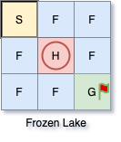
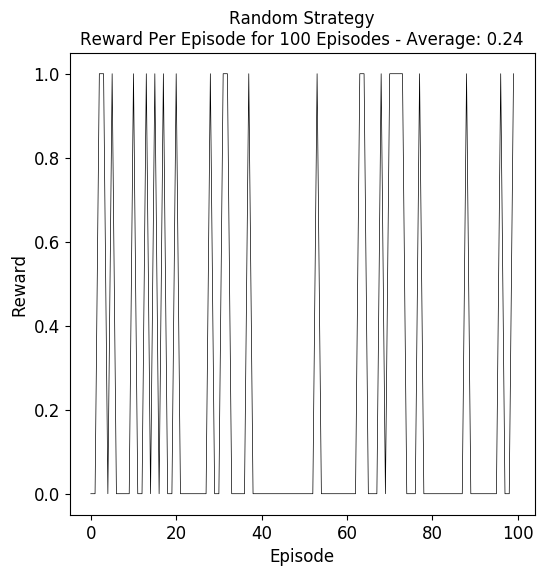
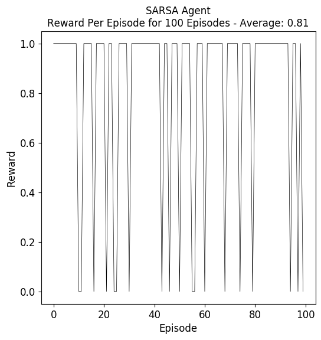

# SARSA Frozen Lake

## Introduction
This project aims to train a SARSA agent to learn policies in the Frozen Lake environment from OpenAI gym.

### Frozen Lake
[Frozen Lake](https://gym.openai.com/envs/FrozenLake-v0/) is an environment where an agent is able to move a character in a grid world. Starting from the state *S*, the agent aims to move the character to the goal state *G* for a reward of 1. Although the agent can pick one of four possible actions at each state including *left*, *down*, *right*, *up*, it only succeeds $\frac{1}{3}$ of the times due to the slippery frozen state *F*. The agent is likely to move to any other directions for the remaining $\frac{2}{3}$ times evenly. Additionally, stepping in a hole state *H* will lead to a bad ending with a reward of 0.

+ S: Start State
+ G: Goal State
+ F: Slippery State
+ H: Hole State

<p align="center"></p>

### Random Strategy
<p align="center"></p>

### SARSA Agent
<p align="center"></p>

## Directory
+ **./img** - to save the output
+ **main.py** - to reproduce the experiments and generate figures directly
+ **main.ipynb** - to view the procudure step by step
```
SARSA-Frozen-Lake/
├── README.md
├── img
├── main.ipynb
├── main.py
└── requirements.txt
```

## Dependencies
+ python >= 3.7.2
+ jupyter >= 1.0.0
+ gym >= 0.15.4
+ tqdm >= 4.41.1
+ numpy >= 1.16.2
+ matplotlib >= 3.1.1

## Setup
Please ensure the following packages are already installed. A virtual environment is recommended.
+ Python (for .py)
+ Jupyter Notebook (for .ipynb)

```
$ cd SARSA-Frozen-Lake/
$ pip3 install pip --upgrade
$ pip3 install -r requirements.txt
```

## Run
To view the note book:
```
$ jupyter notebook
```
To run the script:
```
$ python3 main.py
```

## Output
If everything goes well, you may see the similar results shown as below.
```
Initialize environment...

SFF
FHF
FFG

An agent taking random actions:
Episode 100 Reward 1.0: 100%|█████████████████████████████| 100/100 [00:00<00:00, 2860.68it/s]
Averaged reward per episode 0.24
Saving output to img/result_img_0.png

SARSA agent:
Episode 1000 Reward 0.0: 100%|██████████████████████████| 1000/1000 [00:00<00:00, 2772.03it/s]
Trained Q Table:
[[0.11833864 0.12764726 0.11830122 0.10965143]
 [0.05782744 0.13956833 0.1052786  0.16751989]
 [0.20571471 0.19419847 0.30342657 0.20114661]
 [0.18734408 0.14452312 0.14835486 0.06992683]
 [0.         0.         0.         0.        ]
 [0.42679779 0.35017348 0.37137972 0.1893355 ]
 [0.2281178  0.3050125  0.28307348 0.2512109 ]
 [0.21656739 0.55051001 0.33186199 0.39988802]
 [0.         0.         0.         0.        ]]
Training Averaged reward per episode 0.281
Episode 100 Reward 0.0: 100%|█████████████████████████████| 100/100 [00:00<00:00, 3300.47it/s]
Training Averaged reward per episode 0.81
Saving output to img/result_img_1.png
Done.
```
Please find output under ***./img***.

## Authors
* **[Ning Shi](https://mrshininnnnn.github.io/)** - MrShininnnnn@gmail.com

## Reference
1. Rummery, G. A., & Niranjan, M. (1994). On-line Q-learning using connectionist systems (Vol. 37). Cambridge, England: University of Cambridge, Department of Engineering.
2. Sutton, R. S., & Barto, A. G. (2018). Reinforcement learning: An introduction. MIT press.